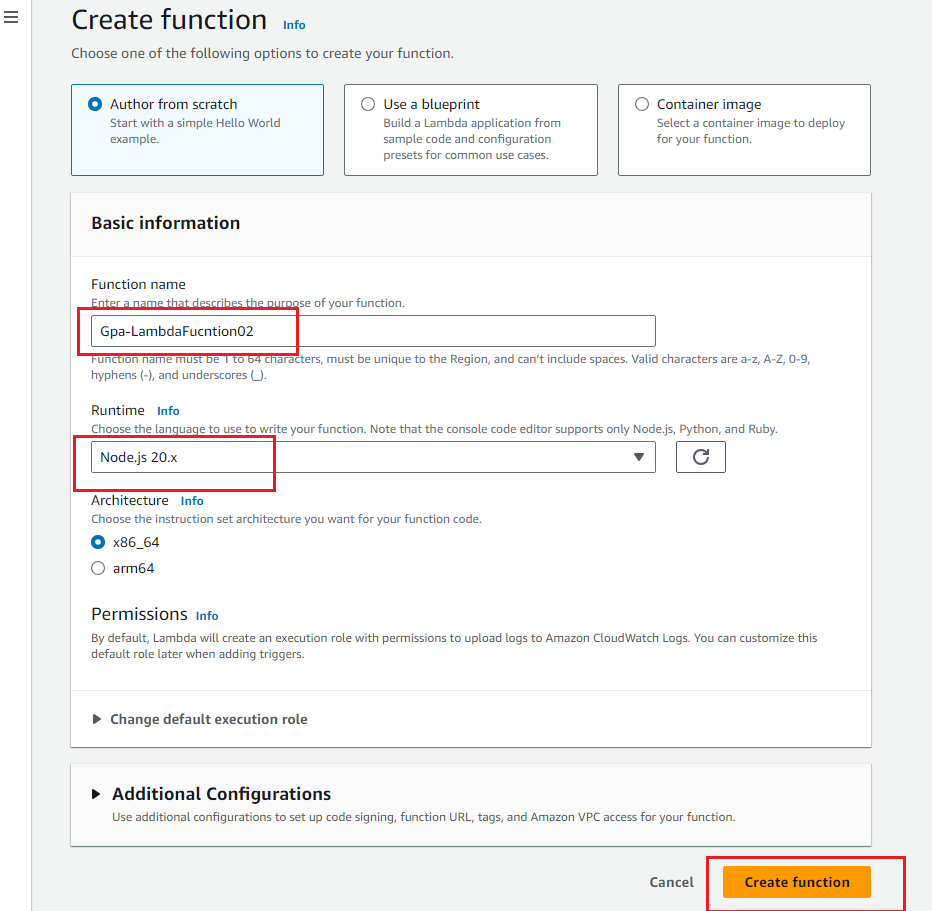
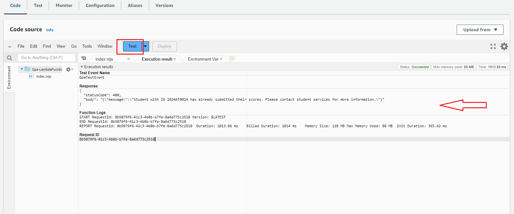
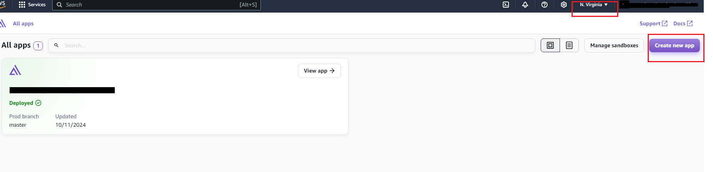

# aws-amplify-student-gpa-calculator


## Introduction

This project is a comprehensive React TypeScript application designed to calculate Grade Point Averages (GPAs) based on provided scores. The calculation employs a specific weight distribution, allocating 30% for assignments (10% for each assignment), 40% for midterms (20% for each midterm), and 30% for the final exam. The resulting GPA is then converted to a standard 4.0 scale and based on GPA, it returns a congratulations message.

## Requirements

- An AWS account (if you don't yet have one, please create one and [set up your environment](https://aws.amazon.com/getting-started/guides/setup-environment/))
- An IAM user that has the access and create AWS resources.
- Set up AWS CLI or use CloudShell
- Understanding of Javascript and TypeScript


## Architecture

The application leverages several AWS services to create a robust, scalable, and secure solution:

1. **AWS Amplify**: Serves as the foundation for the frontend development and deployment, providing a seamless integration with other AWS services
2. **AWS Lambda**: Handles serverless compute functions, allowing for efficient processing of GPA calculations without managing servers.
3. **Amazon DynamoDB**: Acts as the NoSQL database to store and retrieve student scores and calculated GPAs.
4. **Amazon API Gateway**: Manages the RESTful API endpoints, facilitating communication between the frontend and backend services.
5. **AWS IAM and Amazon Cognito**: Ensure secure user authentication and authorization, protecting sensitive student data and controlling access to AWS resources
All services will be created in **us-east-1 region**
<br>
 


###  Getting starting

####  1.  Clone the repository and navigate to the project directory
  
 ``` git clone https://github.com/fermat01/aws-amplify-student-gpa-calculator.git ```


 #### 2. Create an AWS Lambda function
 - Go to lambda service in AWS console and  select  **Create a function**.

 


- In the lambda create page you can give a lambda function name and you can select Runtime environment. Let's  call our function as ```Gpa-LambdaFucntion02``` and as  runtime, select Node.js 20. Leave other settings default, and then select the Create function.

 

- After lambda function created, we can edit our lambda function. Copy and paste given code in lambda_function folder called gpa_calculation_lambda.js into lambda online editor as a showing on the below screenshot then click Deploy button to deploy your lambda function.
- 
 

- In left side click on  **Additional ressources** and **Layers** then **Create Layer**

 

- In lambda_function folder, there is zip file called  ``` joi-layer.zip ```, upload it and click  **Create**

 

 - After updated lambda function deployed Click Test button. Now let's create test event for testing  lambda function. Give name for test event and modify the event JSON as showing in the screenshot and then click Save button.

``` 
{
  "studentId": "2024AT0014",
  "firstName": "Mike",
  "lastName": "Billy",
  "assignment1": "78",
  "assignment2": "85",
  "assignment3": "68",
  "midterm1": "98",
  "midterm2": "79",
  "final": "87"
}
```

 

- Now click again Test button and check execution test result.

 


 #### 3. Create Rest API using API Gateway

After  successfully created lambda function, we need API to communicate between our React app and lambda function, for that we will use AWS API Gateway service.

- Go to API gateway service in AWS console and select **REST API** option and click the Build.

 

- Now click the Create Method button and then you will redirect to API creation page. 

 

- At the API creation page as a method type select the POST and then select the Lambda function as an integration type and choose, we earlier create lambda function from dropdown and click Create method button to create a POST API for our application.

 

- Now we need to enable CORS settings. Select the “/” option above the newly created POST method.


 


- In the CORS setting, tick the POST method under the Access-Control-Allow-Methods, leave the other settings default and click the Save button.


 

- After enabling the CORS, we need to deploy our API, so to do that click the Deploy button on the left side upper corner.


- **Create GET method with ressource path check-student with same process as POST method**
  
- And the final result will look like:
  

 


 #### 4. Create a DynamoDB Table & Set up IAM Policies and Permissions

   ... 

 #### 5. Create an AWS Cognito user pool
   ...

#### 6.  Deploy the app on AWS Amplify 

- Log into AWS Management Console, choose us-east-1 region, then go to Amplify service and click on **create new app**.

 

- Select GitHub for the connect your repository to build, deploy, and host your React app and Select Continue. 

 

- After that you will be automatically redirect to GitHub to authenticate.
In here you can give full access to amplify to access all your repositories or only select repositories. Select the second option and then choose your relevant repository and authorize then you will be redirect Amplify console.
Choose the repository and main branch of the repository, then select **Next**.


- Keep the default build settings and click on Edit YML file under the Frontend build command. Copy the provided amplify.yml file and paste it here as shown. **Save** and click **Next**


- Review the final details and select **Save** and **Deploy**.
 


 Amplify will now build your code and deploy. You can access your deployed application clicking given URL (https://master … amplifyapp.com).


###  Conclusion

This React TypeScript GPA calculator application, integrated with AWS services, represents a powerful and efficient solution for academic performance tracking. By leveraging the robust capabilities of AWS Amplify, Lambda, DynamoDB, API Gateway, IAM, and Cognito, the project delivers a secure, scalable, and user-friendly platform for students and educational institutions alike.
This project not only serves as a practical tool for GPA calculation but also demonstrates the power of combining modern frontend technologies with cloud services. It sets a solid foundation for future enhancements, such as integrating with learning management systems, generating performance reports, or expanding to include more complex grading systems.


